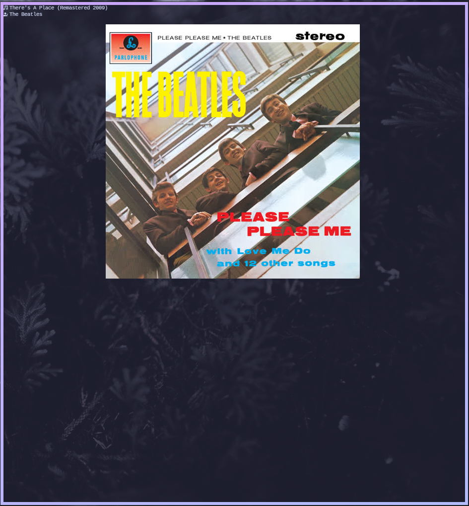

# Que es esto
Sirve para que puedas ver las portadas de tus canciones en CMUS
# ¿Que soporta?
Solo el protocolo de imagenes kitty por ahora
# COMO COMPILO
gcc portada.c -o portada

Y para instalar solo mueve el binario a /usr/bin/ o ni idea, lo que quieras :P

# Caracteristicas
- Ligero
- No usa dependencias mas que las del sistema
- Funciona

# Imagen de demostracion

# Extras
Como no voy a crear un repositorio para todo, letras.sh muestra las letras de las canciones.

A continuacion una muestra con CMUS, Cava, letras.sh y portada

# todo
- Barra de progreso
