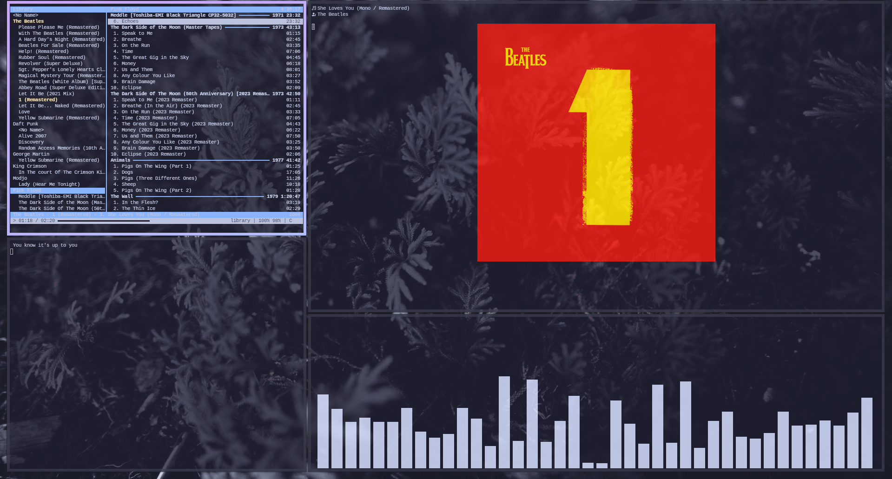

# Que es esto
Sirve para que puedas ver las portadas de tus canciones en CMUS

Si obtienes un error o tienes una sugerencia, realiza un Issue
# ¿Que soporta?
Solo el protocolo de imagenes kitty por ahora
# COMO COMPILO
Ejecuta el archivo make.sh
Y para instalar solo mueve el binario a /usr/bin/ o ni idea, lo que quieras :P
# Que ocupas
- FFMPEG
- CMUS con cmus-remote
- La terminal kitty
# Imagen de demostracion

# Extras
Como no voy a crear un repositorio para todo, letras.sh muestra las letras de las canciones. (Solo si hay archivo .lrc)
